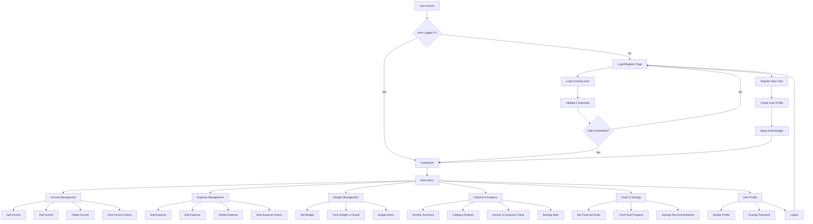
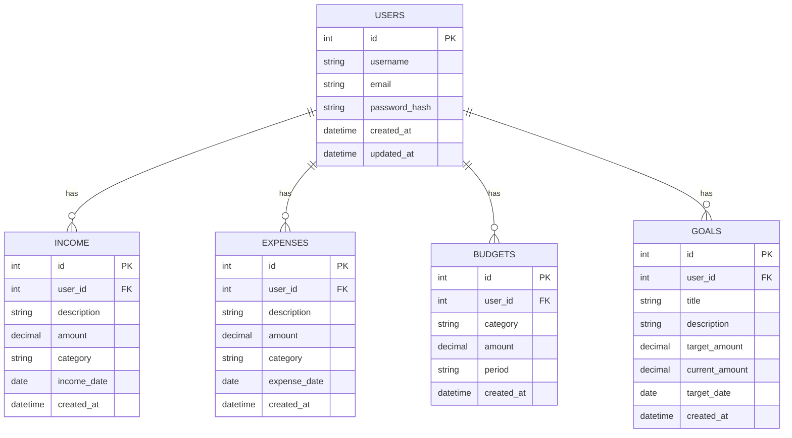
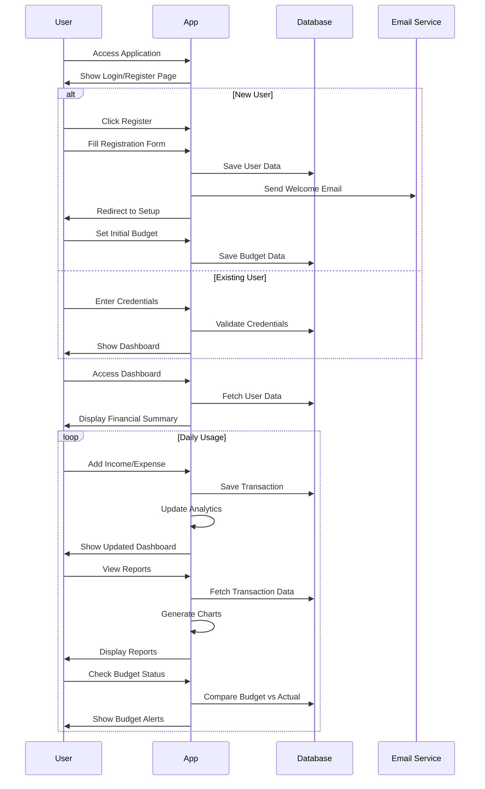
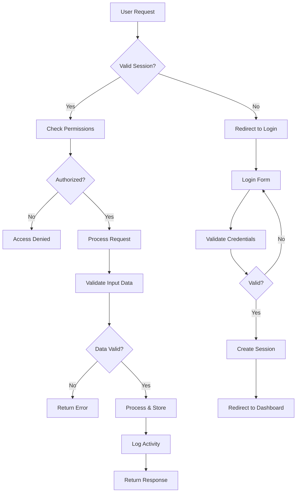

# Finance Management App - Flow Diagram

## Application Flow

```mermaid
graph TD
    A[User Access] --> B{User Logged In?}
    B -->|No| C[Login/Register Page]
    B -->|Yes| D[Dashboard]
    
    C --> E[Register New User]
    C --> F[Login Existing User]
    
    E --> G[Create User Profile]
    F --> H[Validate Credentials]
    
    G --> I[Setup Initial Budget]
    H --> J{Valid Credentials?}
    
    J -->|No| C
    J -->|Yes| D
    
    I --> D
    
    D --> K[Main Menu]
    K --> L[Income Management]
    K --> M[Expense Management]
    K --> N[Budget Management]
    K --> O[Reports & Analytics]
    K --> P[Goals & Savings]
    K --> Q[User Profile]
    
    L --> R[Add Income]
    L --> S[Edit Income]
    L --> T[Delete Income]
    L --> U[View Income History]
    
    M --> V[Add Expense]
    M --> W[Edit Expense]
    M --> X[Delete Expense]
    M --> Y[View Expense History]
    
    N --> Z[Set Budget]
    N --> AA[Track Budget vs Actual]
    N --> BB[Budget Alerts]
    
    O --> CC[Monthly Summary]
    O --> DD[Category Analysis]
    O --> EE[Income vs Expense Charts]
    O --> FF[Savings Rate]
    
    P --> GG[Set Financial Goals]
    P --> HH[Track Goal Progress]
    P --> II[Savings Recommendations]
    
    Q --> JJ[Update Profile]
    Q --> KK[Change Password]
    Q --> LL[Logout]
    
    LL --> C
```

## Database Schema Flow

```mermaid
erDiagram
    USERS {
        int id PK
        string username
        string email
        string password_hash
        datetime created_at
        datetime updated_at
    }
    
    INCOME {
        int id PK
        int user_id FK
        string description
        decimal amount
        string category
        date income_date
        datetime created_at
    }
    
    EXPENSES {
        int id PK
        int user_id FK
        string description
        decimal amount
        string category
        date expense_date
        datetime created_at
    }
    
    BUDGETS {
        int id PK
        int user_id FK
        string category
        decimal amount
        string period
        datetime created_at
    }
    
    GOALS {
        int id PK
        int user_id FK
        string title
        string description
        decimal target_amount
        decimal current_amount
        date target_date
        datetime created_at
    }
    
    USERS ||--o{ INCOME : has
    USERS ||--o{ EXPENSES : has
    USERS ||--o{ BUDGETS : has
    USERS ||--o{ GOALS : has
```

## User Journey Flow

```mermaid
sequenceDiagram
    participant U as User
    participant A as App
    participant D as Database
    participant E as Email Service
    
    U->>A: Access Application
    A->>U: Show Login/Register Page
    
    alt New User
        U->>A: Click Register
        U->>A: Fill Registration Form
        A->>D: Save User Data
        A->>E: Send Welcome Email
        A->>U: Redirect to Setup
        U->>A: Set Initial Budget
        A->>D: Save Budget Data
    else Existing User
        U->>A: Enter Credentials
        A->>D: Validate Credentials
        A->>U: Show Dashboard
    end
    
    U->>A: Access Dashboard
    A->>D: Fetch User Data
    A->>U: Display Financial Summary
    
    loop Daily Usage
        U->>A: Add Income/Expense
        A->>D: Save Transaction
        A->>A: Update Analytics
        A->>U: Show Updated Dashboard
        
        U->>A: View Reports
        A->>D: Fetch Transaction Data
        A->>A: Generate Charts
        A->>U: Display Reports
        
        U->>A: Check Budget Status
        A->>D: Compare Budget vs Actual
        A->>U: Show Budget Alerts
    end
```

## Security Flow

```mermaid
graph TD
    A[User Request] --> B{Valid Session?}
    B -->|No| C[Redirect to Login]
    B -->|Yes| D[Check Permissions]
    
    D --> E{Authorized?}
    E -->|No| F[Access Denied]
    E -->|Yes| G[Process Request]
    
    G --> H[Validate Input Data]
    H --> I{Data Valid?}
    I -->|No| J[Return Error]
    I -->|Yes| K[Process & Store]
    
    K --> L[Log Activity]
    L --> M[Return Response]
    
    C --> N[Login Form]
    N --> O[Validate Credentials]
    O --> P{Valid?}
    P -->|No| N
    P -->|Yes| Q[Create Session]
    Q --> R[Redirect to Dashboard]
``` 